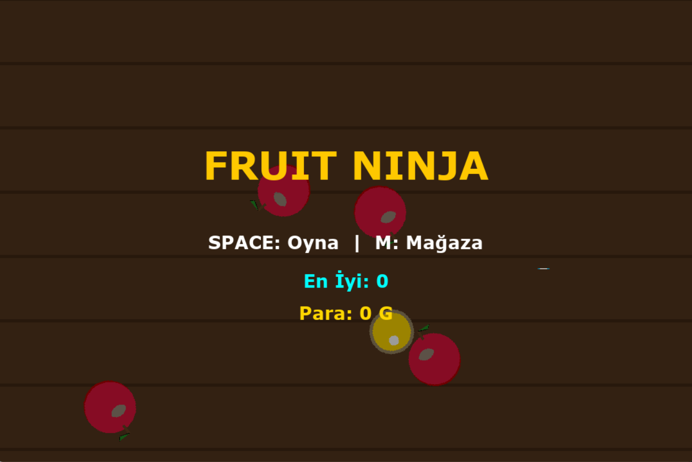

Pure Python Fruit Ninja (No Assets & Procedural Audio)

> **"No images. No sound files. Just Code."**

This project is a technical recreation of the popular game *Fruit Ninja*, built entirely in Python using `pygame`. 

What makes this project unique? **It uses zero external assets.** * Every fruit, particle, and UI element is drawn in real-time using geometric primitives.
* Every sound effect is generated mathematically (DSP) using sine waves and noise generation.



## Features

### 100% Procedural Graphics
Instead of loading `.png` sprites, the game renders everything using code:
* **Fruits:** Circles, arcs, and polygons form apples, kiwis, and watermelons.
* **Effects:** Blade trails, juice splatters, and smoke are particle systems generated on the fly.
* **UI:** Custom-drawn menus and scoreboards.

### Procedural Audio Engine (DSP)
There are no `.mp3` or `.wav` files in the source code.
* Included `sound_generator.py` script uses Python's native `wave` and `struct` libraries.
* It manipulates **Sine Waves** to create frequency sweeps (for the sword "swoosh") and generates noise for impacts.

### Gameplay Mechanics
* **Physics:** Custom gravity and collision detection logic.
* **Shop System:** Buy different blades (Fire, Matrix, Void) with in-game currency.
* **Combo System:** Chain hits for higher scores.
* **Special Fruits:** Ice fruit (freezes time), Bomb (game over), Banana (extra life).

##  Installation & How to Run

Since this project generates its own assets, follow these steps strictly:

1.  **Clone the Repository**
    ```bash
    git clone [https://github.com/KULLANICI_ADIN/Pure-Python-Fruit-Ninja.git](https://github.com/KULLANICI_ADIN/Pure-Python-Fruit-Ninja.git)
    cd Pure-Python-Fruit-Ninja
    ```

2.  **Install Dependencies**
    You only need `pygame`.
    ```bash
    pip install -r requirements.txt
    ```

3.  **Generate Audio Assets (Crucial Step!)**
    Run the sound generator script first. This will create the necessary `.wav` files in your directory using mathematical formulas.
    ```bash
    python sound_generator.py
    ```

4.  **Run the Game**
    ```bash
    python main.py
    ```

##  Controls

* Mouse: Move to slice fruits.
* Space: Start Game.
* M: Open Shop (Buy blades).
* P: Pause Game.
* R: Restart (on Game Over screen).
* ESC: Return to Menu.

##  Technical Highlights

### Digital Signal Processing (DSP)
The audio generation relies on creating raw byte data. For example, the "Throw" sound is a frequency sweep from 400Hz to 800Hz:
```python
# Simplified logic from sound_generator.py
value = math.sin(2 * math.pi * freq * t)
